 # Glossar

| Fachbegriff | Englisch | Beschreibung |
| ------------ | -------- | ------------- |
| Wörter pro Minute/Sekunde | words per minute/second | durchschnittliche Anzahl der final korrekt getippten Wörter pro Minute/Sekunde. Abkürzung: wpm / wps |
| Wörter | words | Zeichenkette, abgetrennt durch Trennzeichen – wobei Trennzeichen nicht als Teil des Wortes betrachtet werden |
| Trennzeichen | delimiter | Leerzeichen und expliziter Zeilenumbruch (ein Tabulator wird in ein einzelnes Leerzeichen übersetzt) |
| Zeichen pro Minute/Sekunde | characters per minute/second | durchschnittliche Anzahl der final korrekt getippten Zeichen pro Minute/Sekunde. Abkürzung: cpm / cps |
| Zeichen | character | ein UTF-8-codiertes Zeichen |
| Tastenanschlag | keystroke | Betätigung einer Taste auf der Tastatur zur Eingabe eines Zeichens |
| Tastenanschläge pro Minute/Sekunde | keystrokes per minute/second | Anzahl der final korrekten Tastenanschläge pro Minute/Sekunde. Abkürzung: kpm / kps |
| korrektes Wort/Zeichen/Tastenanschlag | correct word/character/keystroke | alle getippten Zeichen, Wörter oder Tastenanschläge, die den vorgegebenen Zeichen, Wörtern oder Tastenanschlägen entsprechen |
| finales Wort/Zeichen/Tastenanschlag | final word/character/keystroke | jedes Wort, Zeichen oder jeder Tastenanschlag, das bzw. der nach Abschluss der Übung besteht |
| Übung | exercise | die Eingabe eines bestimmten (generierten) Textes mit anschließender Auswertung |
| Text | text | eine Folge von Zeichen |
| generierter Text | generated text | ein Text, der auf Basis einer Menge angegebener Zeichen generiert wird |
| Gastgeberperson | host | die Person, die eine Sitzung erstellt |
| Sitzung | session | mindestens zwei teilnehmende Personen (einschließlich der Gastgeberperson) führen dieselbe Übung durch und erhalten nach Abschluss aller Teilnehmenden die Statistiken aller |
| teilnehmende Person | participant | eine Person (ggf. die Gastgeberperson), die an einer Sitzung teilnimmt |

# Value Objects
- Zeichen
    - bool isDelimiter()
    - KeyStrokeCount keyStrokeCount()
- Wort (erst für Auswertung bestimmt)
    - CharCount charCount()
- Text
    - Array<Zeichen>
- CharCount
- KeyStrokeCount
- WordsPerMinute/WordsPerSecond
- CharactersPerMinute/CharactersPerSecond
- KeyStrokePerMinute/KeyStrokePerSecond
- CharProgressType
    - CORRECT
    - INCORRECT
- AdvanceType
    - HOLD
    - ADVANCE_CORRECT
    - ADVANCE_INCORRECT
- TextGeneratorConfig

# Entities/Aggregates
- InputText
    - attributes:
        - List<Zeichen> inputCharacters
    - methods:
        - void read(char)
        - Text toText()
- TextProgress
    - attributes:
        - Text expectedText
        - InputText inputText
    - methods:
        - ProgressType isNextChar(char)
        - void advance(char)
        - void delete_one_char()
        - bool isFinished()
- Corrector (Interface)
    - AdvanceType take(char)
    - void delete_one_char()
    - bool isFinished()
    - MistakeCount getMistakeCount()
    - TextProgress getTextProgress()
- BlockingCorrector impl Corrector
    ```java
    if isNextChar(x) {
        advance(H)
        return ADVANCE_CORRECT;
    } else {
        return HOLD;
    }
    ```
- NonBlockingCorrector impl Corrector
    ```java
    if isNextChar(x) {
        advance(H)
        return ADVANCE_CORRECT;
    } else {
        advance(H)
        return ADVANCE_INCORRECT;
    }
    ```
- Exercise
    - attributes
        - Corrector
        - ExerciseUI (Interface)
        - TotalTime time // if time is set, isFinished is true
    - methods
        - void take(char) // start time with first char
        - void delete_one_char()
        - bool isFinished()
        - ExerciseEvaluator toExerciseEvaluator()
- ExerciseEvaluator
    - attributes:
        - TextProgress
        - MistakeCount
        - TimeDiff
    - methods:
        - new(TextProgress, MistakeCount, TimeDiff)
- ExerciseRecord (JavaRecord)
    - tbd. after ExerciseEvaluator implementation
- TextGenerator (Interface)
    - from_raw_string(String)
    - from_generator_config(TextGeneratorConfig)
# New

- UI Interface methods
- Workflows
- 

```mermaid
---
title: Spyter Entity Diagram
---
classDiagram
    %% Value Objects
    class Character {
        - char value
        + bool isDelimiter()
        + KeyStrokeCount getKeyStrokeCount()
    }
    class Word {
        - List<Character> characters
        + CharacterCount getCharacterCount()
    }
    class Text {
        - List<Character> characters
    }
    class CharacterCorrectionType {
        <<enumeration>>
        CORRECT,
        INCORRECT
    }
    class AdvanceType {
        <<enumeration>>
        HOLD,
        ADVANCE_CORRECT,
        ADVANCE_INCORRECT
    }
    note for TextGeneratorConfiguration "Contents to be discussed"
    class TextGeneratorConfiguration {}

    class TypedText {
        - List<TypedCharacter> typedCharacters
    }

    class TypedCharacter {
        - Character character
        - CharacterCorrectionType correctionType
    }

    %% Entities
    class InputText {
        - List<Character> inputCharacters
        + void add(Character char)
    }
    class TextProgress {
        - Text expectedText
        - InputText inputText
        + ProgressType isNextChar(Character char)
        + void advance(Character char)
        + void deleteOneChar()
        + bool isFinished()
    }
    class Corrector {
        <<interface>>
        + AdvanceType take(Character char)
        + void deleteOneChar()
        + bool isFinished()
        + ExerciseEvaluator toExerciseEvaluator()
        + MistakeCount getMistakeCount()
        + Textprogress getTextProgress()
    }
    note for BlockingCorrector "Does not advance if Character is incorrect"
    class BlockingCorrector {}
    Corrector <|.. BlockingCorrector
    note for NonBlockingCorrector "Does advance if Character is incorrect"
    class NonBlockingCorrector {}
    Corrector <|.. NonBlockingCorrector

    class Exercise {
        - TimeDelta timeDelta
        + void take(Character char)
        + void deleteOneChar()
        + bool isFinished()
        + ExerciseEvaluator toExerciseEvaluator()
    }
    Exercise "1" -- "1" Corrector: corrector
    Exercise "1" -- "1" ExerciseUI: ui


    class ExerciseEvaluator {
        - TextProgress progress
        - MistakeCount mistakeCount
        - TimeDelta timeDelta
        + ExerciseEvaluator new(TextProgress progress, MistakeCount mistakeCount, TimeDelta timeDelta)
        + ExerciseResult generateExerciseResult()
    }

    class ExerciseResult {
       <<record>> 
    }

    class TextGenerator {
        <<interface>>
        + Text fromRawString(String text)
        + Text fromTextGeneratorConfiguration(TextGeneratorConfiguration configuration)
    }
    
    class ExerciseUI {
        <<interface>>
        + void setReferenceText(Text text)
        + void setTypedText(TypedText typedText)
    }
    note for Spyter "Worflows will be added here"
    class Spyter {
        + void main()
        + void run(...Args args)
        + ExerciseConfig configureExercise(...)
    }
```

